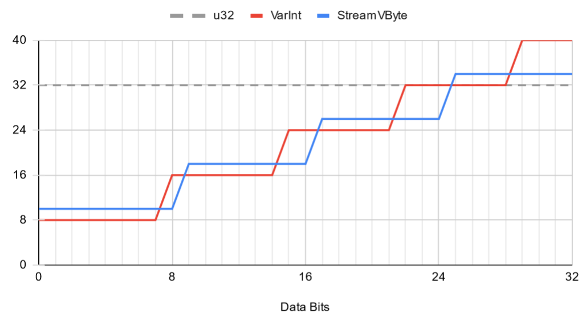

Unreleased. Work-in-progress.

A Rust implementation of [StreamVByte][svb], a SIMD-optimized
integer-compression scheme. It is similar to [_varint_ encoding][varint] used by
Protocol Buffers, but stores the control metadata as a separate stream.

[svb]: https://github.com/lemire/streamvbyte
[varint]: https://developers.google.com/protocol-buffers/docs/encoding

# Compression Ratio compared to varint

Both schemes compress by removing 0 bytes at the top end of the number. VarInt
uses one control bit per 7 data bits. StreamVByte uses a constant number of 2
control bits per number.

| Number Range     | Bits VarInt | Bits StreamVByte |
|------------------|-------------|------------------|
| 0 to 127         | 8    (25%)  | 10   (31%)       |
| 128 to 255       | 16   (50%)  | 10   (31%)       |
| 256 to 16383     | 16   (50%)  | 18   (56%)       |
| 2^14 to 2^16-1   | 24   (75%)  | 18   (56%)       |
| 2^16 to 2^21-1   | 24   (75%)  | 26   (81%)       |
| 2^21 to 2^24-1   | 32  (100%)  | 26   (81%)       |
| 2^24 to 2^28-1   | 32  (100%)  | 34  (106%)       |
| 2^28 to 2^32-1   | 40  (125%)  | 34  (106%)       |

Graphically:



# Performance

To run the benchmarks on your machine run:

```sh
RUSTFLAGS="-C target-cpu=native" cargo bench
```

The following numbers are for encoding and decoding of 4096 32bit numbers
(16KiB). Both encoding and decoding is a bit faster if all input values fit into
8 bits. We include memcpy as a reference.

All benchmarks are single-threaded. Note that we are counting elements, not
bytes.

| Benchmark      | Platform                    | Elements/second |
|----------------|-----------------------------|----------------:|
| memcpy         | AMD Ryzen 9 3900X           |           16.8G |
| scalar_encode  | AMD Ryzen 9 3900X           |          ~0.96G |
| scalar_decode  | AMD Ryzen 9 3900X           |          ~1.44G |
| simd_encode    | AMD Ryzen 9 3900X           |     4.1G - 4.7G |
| simd_decode    | AMD Ryzen 9 3900X           |     6.1G - 6.2G |
| memcpy         | Apple M1 (Macbook Air 2020) |    9.5G - 15.8G |
| scalar_encode  | Apple M1 (Macbook Air 2020) |          ~1.37G |
| scalar_decode  | Apple M1 (Macbook Air 2020) |          ~1.38G |
| simd_encode    | Apple M1 (Macbook Air 2020) |     4.8G - 4.9G |
| simd_decode    | Apple M1 (Macbook Air 2020) |     6.5G - 6.7G |


Note: Decoder performs bounds checks. The original C version can read out of
bounds memory if you give it the wrong length parameter.
